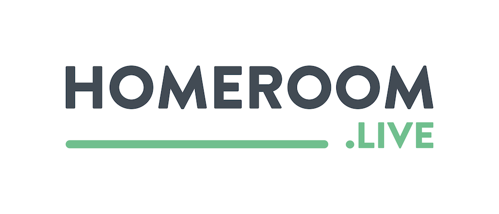

# homeroom 🧠

<p align="center"></p>

Homeroom is a learning platform where anyone can share something they are good at.

Our main goal is to let anyone be able to present their ideas and connect with their followers in a more intimiate way.

The core of our platform is a classroom which is a meeting point for all the students and teachers working on specific project.

## Server

### Development setup

```bash
yarn
yarn dev
```

```bash
NODE_ENV="dev"

STRIPE_ID=""
STRIPE_SECRET=""

PROXY_ENDPOINT="http://localhost:2000"
```

## Webpage

```bash
yarn
yarn dev
```

```bash
NODE_ENV="dev"

AUTH0_CLIENT_ID="wgs42OsBgiU2mtfle0ZVVXe6oC7EwqVM"
AUTH0_DOMAIN="homeroom.auth0.com"
AUTH0_REDIRECT_URL="http://localhost:3000/callback"

PRISMA_ENDPOINT="http://localhost:4000"
PRISMA_WS_ENDPOINT="ws://localhost:4000"

STRIPE_KEY=pk_test_38SQAjAQtgRWeHZ4ku9qYxlk
STRIPE_ID=ca_CBUYuNLPtAOQ2fcA3npklS9HaWZGXKzk
STRIPE_CALLBACK=http://localhost:3000/profile/settings/stripe
```

## Proxy

```bash
yarn
yarn dev
```

## License

By Matic and Logan
